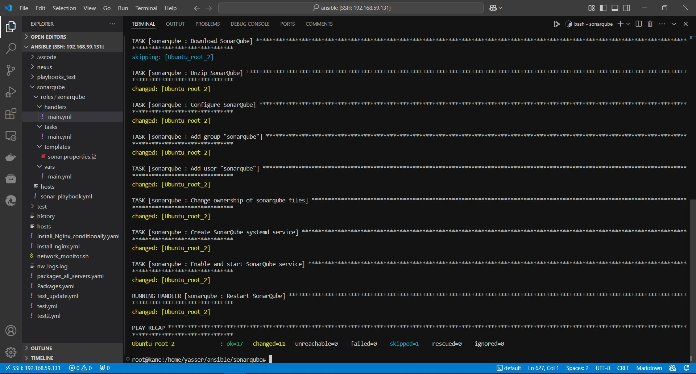
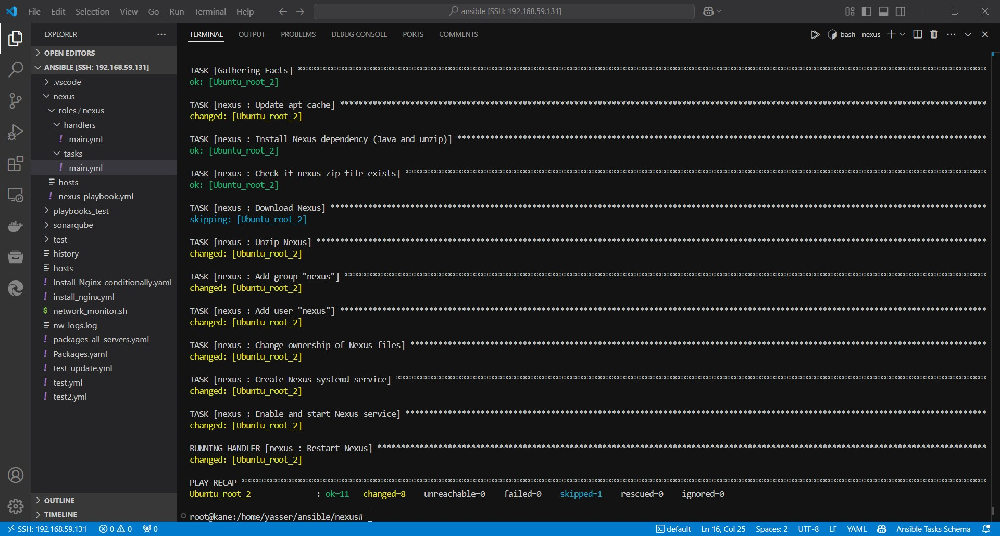

# DevOps Assignment 2: Linux Basics and Networking

**Trainee Name: Yasser Ahmed**  
**Group: ALX2_SWD1_G1**  

## 1. What is Ansible? Explain its main purpose and advantages in IT automation

Ansible is a software that automates software provisioning, configuration management, and application deployment.

### Why Ansible?

Ansible is favored due to the many benefits it provides, including:

- **Simplicity:** Easy to learn and use, with human-readable configurations.
- **State-Driven:** Focuses on desired system state, ensuring reliable and repeatable outcomes.
- **Security:** Utilizes secure SSH communication and is agentless.
- **Comprehensive:** Includes a vast library of pre-built modules and integrates with Ansible Galaxy for community-contributed resources.
- **Flexibility:** Supports simple command-line execution and complex playbooks.
- **Idempotency:** Ensures that changes are applied only when necessary, preventing unintended side effects.
- **Time Savings:** Automates repetitive tasks, speeding up updates and deployments.
- **Improved Availability:** Faster issue resolution, better troubleshooting.
- **Reduced Risk:** Minimizes downtime and errors, enhances security, and compliance.
- **Increased Control:** Enforces best practices and ensures consistency.
- **Efficiency:** Enables "doing more with less" by automating mundane tasks.

---

## 2. Describe the main components of Ansible and their roles in automation. Provide examples where necessary

### Ansible Components

1. **Control Node**
2. **Managed Nodes**
3. **Inventory**
4. **Modules**
5. **Playbooks**
6. **Variables**
7. **Handlers**
8. **Roles**
9. **Template**
10. **Ansible Vault**
11. **Ansible Galaxy**
12. **Plugins**

---

### 1. Control Node

The control node is where you execute your Ansible commands and manage your automation tasks. It can be any machine with Ansible installed, and it's responsible for sending instructions to the managed nodes

---

### 2. Managed Nodes

These are the devices or systems you want to automate and manage using Ansible. Managed nodes could be servers, network devices, or any endpoint that you want to configure or manage

---

### 3. Inventory

The inventory is a file that lists the managed nodes, categorized into groups. This allows you to run tasks on specific groups of servers. For example:

```ini
[myenv]
localhost ansible_connection=local

[server1]
Ubuntu_root_1 ansible_host=192.168.59.132 ansible_user=root ansible_ssh_pass="1234567890"

[server2]
Ubuntu_root_2 ansible_host=192.168.59.144 ansible_user=root ansible_ssh_private_key_file=~/.ssh/id_rsa
```

---

### 4. Modules

Modules are the units of work in Ansible, and they perform specific tasks like installing packages, managing files, or configuring services. For example, the `apt` module can install packages on Ubuntu-based systems:

```yaml
---
- name: Install python
  apt:
    name: python3
    state: present
```

---

### 5. Playbooks

Playbooks are YAML files that define a set of tasks to be executed on managed nodes. They describe the desired state of the system. For example:

```yaml
---
- hosts: server2
  tasks:
    - name: Install python
      apt:
        name: python
        state: present
```

---

### 6. Variables

Variables allow you to customize your tasks and playbooks dynamically. For example:

```yaml
---
vars:
  http_port: 80

tasks:
  - name: Open HTTP port
    firewalld:
      port: "{{ http_port }}/tcp"
      state: enabled
```

---

### 7. Handlers

Handlers are special tasks that run when notified by other tasks. They are typically used to restart services after a configuration change. For example:

```yaml
---
tasks:
  - name: Install Apache
    apt:
      name: httpd
      state: present
    notify: Restart Apache

handlers:
  - name: Restart Apache
    service:
      name: httpd
      state: restarted
```

---

### 8. Roles

Roles are a way to organize and reuse playbooks and tasks. They allow you to group related tasks, variables, and files together. For example, a "webserver" role might include tasks to install Apache, configure virtual hosts, and start the service.

### Example: Webserver Role

Imagine you have a role called `webserver` that installs and configures Apache. The directory structure might look like this:

```structure
roles/
└── webserver/
    ├── tasks/
    │   └── main.yml
    └── handlers/
        └── main.yml
```

**roles/webserver/tasks/main.yml**:

```yaml
- name: Install Apache
  apt:
    name: httpd
    state: present
  notify: Restart Apache
```

**roles/webserver/handlers/main.yml**:

```yaml
- name: Restart Apache
  service:
    name: httpd
    state: restarted
```

In your playbook, you would use the role like this:

```yaml
---
- hosts: webservers
  roles:
    - webserver
```

---

### 9. Templates

Templates allow you to create dynamic configuration files using the Jinja2 templating language. For example, a template for an Apache virtual host might look like this:

```html
<VirtualHost *:80>
    ServerAdmin {{ server_admin }}
    ServerName {{ server_name }}
    DocumentRoot {{ doc_root }}
</VirtualHost>
```

---

### 10. Ansible Vault

Ansible Vault allows you to securely store and manage sensitive data, like passwords and keys, in encrypted files. For example:

```sh
ansible-vault encrypt secrets.yml
ansible-vault decrypt secrets.yml
```

---

### 11. ansible-galaxy

Ansible Galaxy is a repository for sharing and downloading roles and collections. You can use `ansible-galaxy` to install roles from the community:

```sh
ansible-galaxy install username.role_name
```

---

### 12. Plugins

Plugins are specialized **Python modules** that extend Ansible's functionality. There are several types of plugins, such as inventory plugins, callback plugins, and lookup plugins.

### Inventory Plugin

An inventory plugin allows you to dynamically generate inventory sources. For instance, you can use a custom inventory plugin to pull inventory data from an API.

**Custom Inventory Plugin (custom_inventory.py)**:

```python
from ansible.plugins.inventory import BaseInventoryPlugin
from ansible.errors import AnsibleError

class InventoryModule(BaseInventoryPlugin):
    NAME = 'custom_inventory'

    def verify_file(self, path):
        valid = super(InventoryModule, self).verify_file(path)
        if valid and path.endswith('custom_inventory.yml'):
            return True
        return False

    def parse(self, inventory, loader, path, cache=True):
        super(InventoryModule, self).parse(inventory, loader, path)
        try:
            data = self._read_config_data(path)
            hosts = data.get('hosts', [])
            for host in hosts:
                self.inventory.add_host(host)
        except Exception as e:
            raise AnsibleError(f"Error parsing inventory: {str(e)}")
```

**Inventory File (custom_inventory.yml)**:

```yaml
---
plugin: custom_inventory
hosts:
  - web1.example.com
  - web2.example.com
```

---

### Callback Plugin

A callback plugin enables you to customize the output of your Ansible runs. For instance, you can create a plugin that logs task results to a file.

**Custom Callback Plugin (custom_callback.py)**:

```python
from ansible.plugins.callback import CallbackBase

class CallbackModule(CallbackBase):
    CALLBACK_VERSION = 2.0
    CALLBACK_TYPE = 'notification'
    CALLBACK_NAME = 'custom_callback'

    def v2_runner_on_ok(self, result):
        host = result._host
        msg = f"{host.name} | SUCCESS | {result.task_name}\n"
        with open('/tmp/ansible.log', 'a') as log_file:
            log_file.write(msg)
```

**ansible.cfg**:

```ini
[defaults]
callback_whitelist = custom_callback
```

---

### Lookup Plugin

Lookup plugins are used to retrieve data from external sources. Let's create a custom lookup plugin that reads data from a JSON file.

**Custom Lookup Plugin (lookup_json.py)**:

```python
from ansible.plugins.lookup import LookupBase
import json

class LookupModule(LookupBase):
    def run(self, terms, variables=None, **kwargs):
        ret = []
        for term in terms:
            with open(term, 'r') as json_file:
                data = json.load(json_file)
                ret.append(data)
        return ret
```

**Example JSON File (data.json)**:

```json
{
  "key1": "value1",
  "key2": "value2"
}
```

**Using the Lookup Plugin in a Playbook**:

```yaml
- hosts: localhost
  tasks:
    - name: Read data from JSON file
      debug:
        msg: "{{ lookup('lookup_json', 'data.json') }}"
```

### Explanation

1. **lookup_json.py**: This is the custom lookup plugin that reads a JSON file and returns its content. The `run` method takes a list of file paths as `terms` and reads the JSON data from each file.
2. **data.json**: An example JSON file that the lookup plugin will read.
3. **Playbook**: In the playbook, the custom lookup plugin is used with the `lookup` function to read the data from the `data.json` file and display it using the `debug` module.

---

## 3. Write an Ansible roles

a. Install SonarQube.

b. Install Nexus Repository Manager.

Note:

- Ensure that the roles include the necessary tasks to install, configure, and start the services.

- Provide comments in your YAML files to explain each step.

### Role 1: SonarQube

#### SonarQube Directory Structure

```structure
roles/
└── sonarqube/
    ├── tasks/
    │   └── main.yml
    ├── handlers/
    │   └── main.yml
    ├── templates/
    │   └── sonar.properties.j2
    └── vars/
        └── main.yml
```

#### sonarqube/tasks/main.yml

```yaml
- name: Update apt cache
  apt:
    update_cache: yes

# Install Java (SonarQube dependency)
- name: Install Java
  apt:
    name: 
      - openjdk-11-jdk
      - unzip
    state: present

# Download SonarQube
- name: Download SonarQube
  get_url:
    url: https://binaries.sonarsource.com/Distribution/sonarqube/sonarqube-9.2.1.49989.zip
    dest: /tmp/sonarqube.zip

# Unzip SonarQube
- name: Unzip SonarQube
  unarchive:
    src: /tmp/sonarqube.zip
    dest: /opt/
    remote_src: yes

# Configure SonarQube
- name: Configure SonarQube
  template:
    src: sonar.properties.j2
    dest: /opt/sonarqube-9.2.1.49989/conf/sonar.properties

# Create a systemd service for SonarQube
- name: Create SonarQube systemd service
  copy:
    content: |
      [Unit]
      Description=SonarQube service
      After=network.target

      [Service]
      Type=forking
      ExecStart=/opt/sonarqube-9.2.1.49989/bin/linux-x86-64/sonar.sh start
      ExecStop=/opt/sonarqube-9.2.1.49989/bin/linux-x86-64/sonar.sh stop
      User=sonarqube
      Group=sonarqube
      Restart=always

      [Install]
      WantedBy=multi-user.target
    dest: /etc/systemd/system/sonarqube.service
  notify: Restart SonarQube

# Enable and start SonarQube service
- name: Enable and start SonarQube service
  systemd:
    name: sonarqube
    enabled: yes
    state: started
```

#### handlers/main.yml

```yaml
# Handler to restart SonarQube
- name: Restart SonarQube 
  systemd:
    name: sonarqube
    state: restarted
```

#### templates/sonar.properties.j2

```properties
sonar.jdbc.username={{ sonarqube_db_user }}
sonar.jdbc.password={{ sonarqube_db_password }}
sonar.jdbc.url=jdbc:postgresql://localhost/sonarqube
```

#### vars/main.yml

```yaml
# Variables for SonarQube configuration
sonarqube_db_user: sonar
sonarqube_db_password: sonar 
```

#### sonar_playbook.yml

```yaml
---
- name: sonarqube playbook  # Playbook name
  hosts: all # Run the playbook on all hosts
  become: yes # Run the playbook as root

  roles:  # Run the roles
    - sonarqube
```

#### hosts

```ini
; [myenv]
; localhost ansible_connection=local
; [server1]
; Ubuntu_root_1 ansible_host=192.168.59.132 ansible_user=root ansible_ssh_pass="1234567890"

[server2]
Ubuntu_root_2 ansible_host=192.168.59.144 ansible_user=root ansible_ssh_pass="1234567890" ansible_ssh_private_key_file=~/.ssh/id_rsa

```



### Role 2: Nexus Repository Manager

#### Nexus Directory Structure

```structure
roles/
└── nexus/
    ├── tasks/
    │   └── main.yml
    ├── handlers/
    │   └── main.yml
```

#### nexus/tasks/main.yml

```yaml
- name: Update apt cache
  apt:
    update_cache: yes

# Install Java (Nexus dependency)
- name: Install Java
  apt:
    name: 
      - openjdk-11-jdk
      - unzip
    state: present

# Create nexus user
- name: Create nexus user
  user:
    name: nexus
    shell: /bin/bash

# Download Nexus Repository Manager
- name: Download Nexus
  get_url:
    url: https://download.sonatype.com/nexus/3/latest-unix.tar.gz
    dest: /tmp/nexus.tar.gz

# Unzip Nexus Repository Manager
- name: Unzip Nexus
  unarchive:
    src: /tmp/nexus.tar.gz
    dest: /opt/
    remote_src: yes

# Change ownership of Nexus files
- name: Change ownership of Nexus files
  file:
    path: /opt/nexus-3.*
    owner: nexus
    group: nexus
    recurse: yes

# Create a systemd service for Nexus
- name: Create Nexus systemd service
  copy:
    content: |
      [Unit]
      Description=nexus service
      After=network.target

      [Service]
      Type=forking
      ExecStart=/opt/nexus-3.*/bin/nexus start
      ExecStop=/opt/nexus-3.*/bin/nexus stop
      User=nexus
      Group=nexus
      Restart=always

      [Install]
      WantedBy=multi-user.target
    dest: /etc/systemd/system/nexus.service
  notify: Restart Nexus

# Enable and start Nexus service
- name: Enable and start Nexus service
  systemd:
    name: nexus
    enabled: yes
    state: started
```

#### nexus/handlers/main.yml

```yaml
# Handler to restart Nexus
- name: Restart Nexus
  systemd:
    name: nexus
    state: restarted
```

#### nexus_playbook.yml

```yaml
---
- name: nexus playbook  # Playbook name
  hosts: all # Run the playbook on all hosts
  become: yes # Run the playbook as root

  roles:  # Run the roles
    - nexus
```

```ini
; [myenv]
; localhost ansible_connection=local
; [server1]
; Ubuntu_root_1 ansible_host=192.168.59.132 ansible_user=root ansible_ssh_pass="1234567890"

[server2]
Ubuntu_root_2 ansible_host=192.168.59.144 ansible_user=root ansible_ssh_pass="1234567890" ansible_ssh_private_key_file=~/.ssh/id_rsa

```


